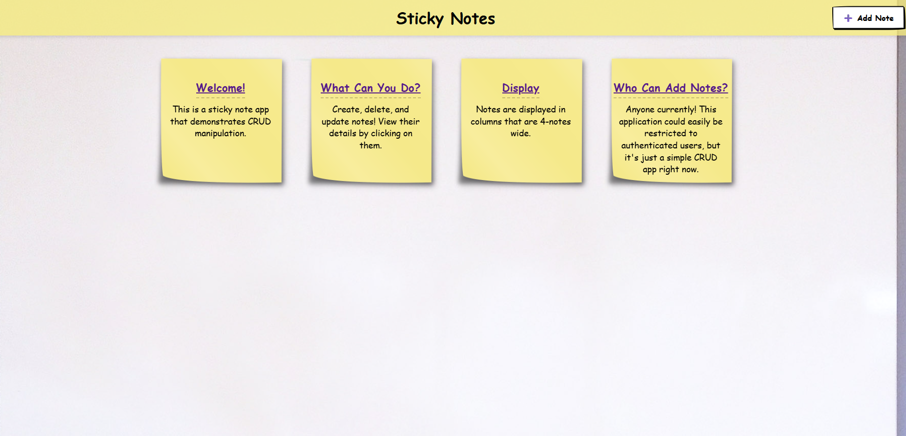
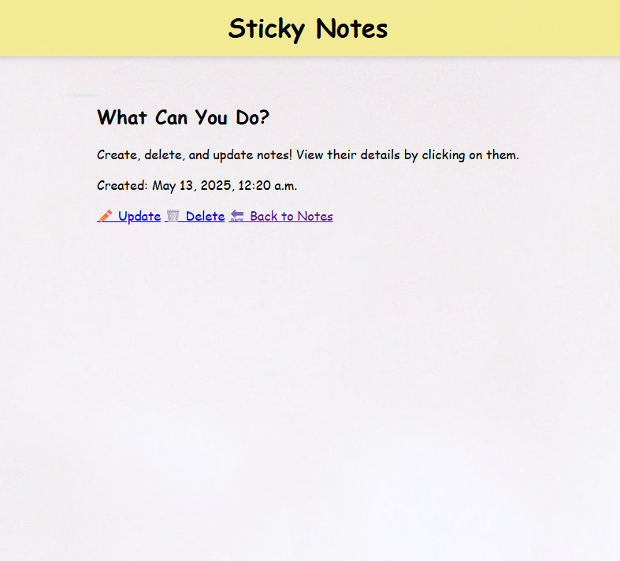

# My Portfolio

A collection of projects showcasing full-stack development skills.

## Projects

### 🗞️ [News App](./news_application)
A full-stack news app built with Django, MySQL, and Docker. Allows the user to register as a journalist, reader, or editor. Journalists can create, edit, and delete articles and newsletters. Editors can edit, approve, or delete articles written by journalists. Once approved, journalist articles appear on the main page and can be subscribed to by readers. If a reader is subscribed to a journalist, they will receive an email when their journalist publishes a newsletter.

 

<strong>📸 Click here to view App Screenshots</strong>

 
### Main Page View

  
### Sign-up Form

  
### Article Details

#### Instructions
To view instructions, click [here](./news_application) to see the project specific README file.

### 🧸 [Ecommerce App](./kids_shopping_app)
A full-stack e-commerce app built with Django, MySQL, and Docker. Allows the user to register as a buyer or seller, browse a marketplace and sort by price or seller, leave verified and unverified reviews, and complete checkout with email confirmation.

### 📝 [Sticky Notes CRUD App](./sticky_notes)
A sticky notes board showcasing CRUD. Notes can be created, updated, and deleted, and appear on a virtual bulletin board.

 

<strong>📸 Click here to view App Screenshots</strong>

 
### Main Page View

  
### Edit Page

### :green_salad: [Restaurant Website](./foodtruck_restaurant_site)
A restaurant website with access to location, menu, about information, and contact details, built using Django.
