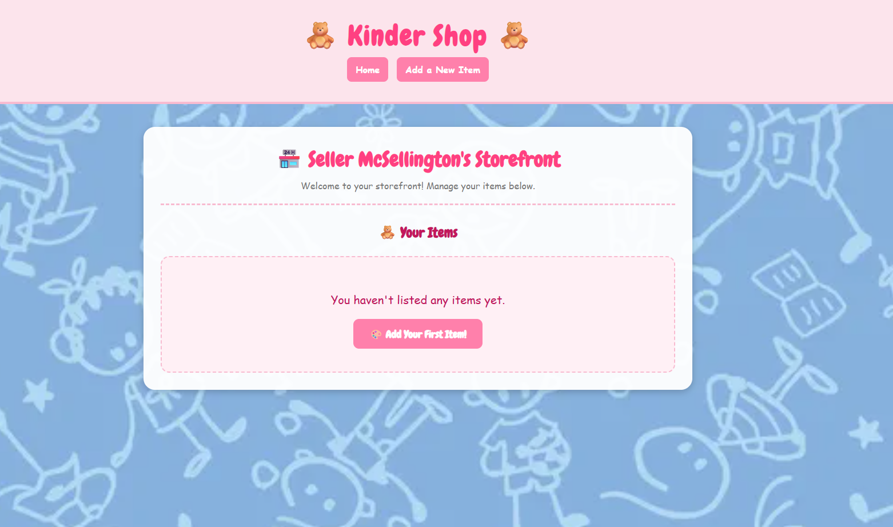
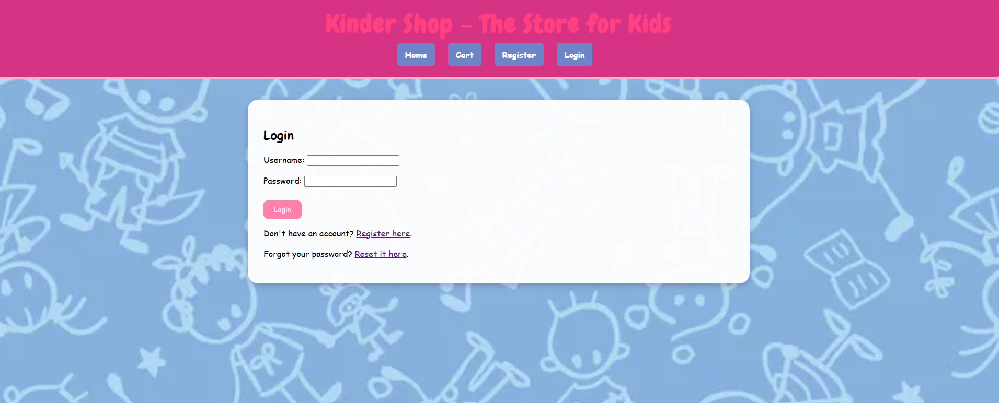
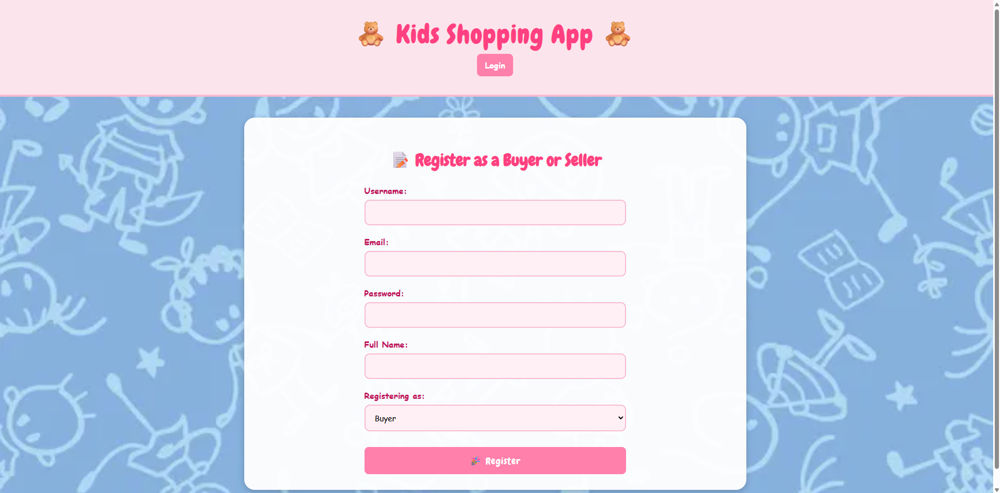
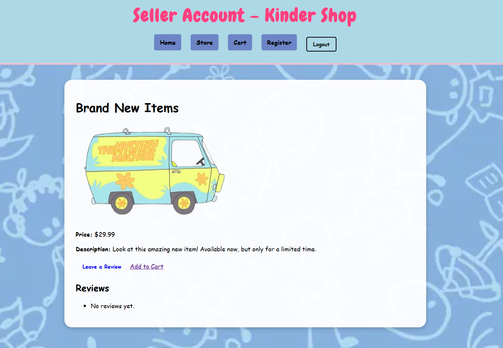
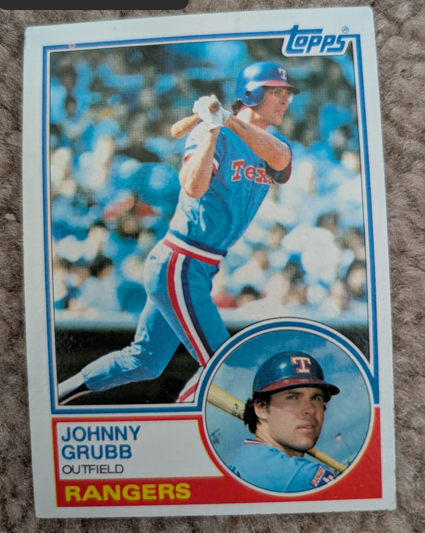
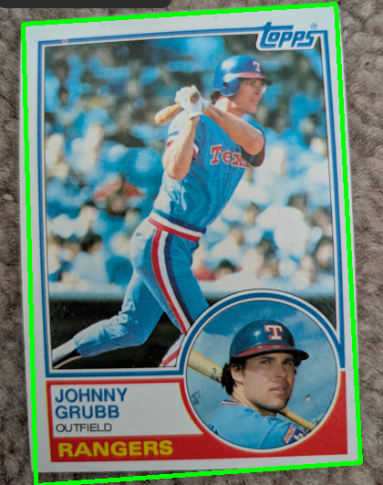
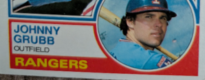
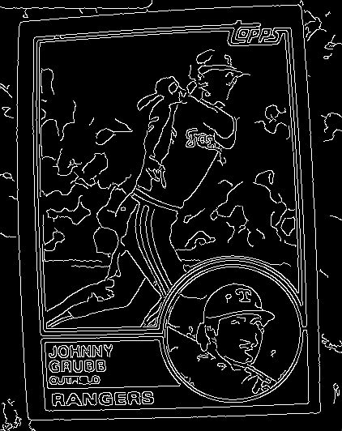
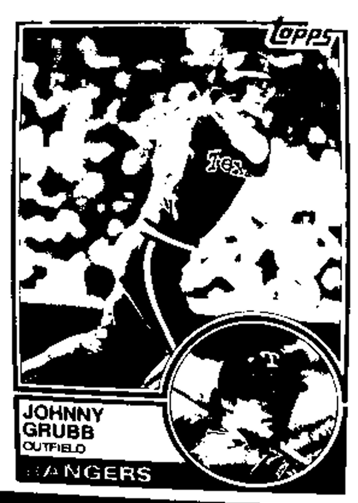
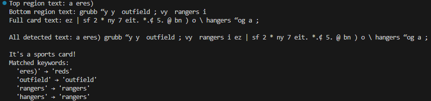

# My Portfolio

A collection of projects showcasing full-stack development skills.

## Projects

### 🗞️ [News App](./news_application)
A full-stack news app built with Django, MySQL, and Docker. Allows the user to register as a journalist, reader, or editor. Journalists can create, edit, and delete articles and newsletters. Editors can edit, approve, or delete articles written by journalists. Once approved, journalist articles appear on the main page and can be subscribed to by readers. If a reader is subscribed to a journalist, they will receive an email when their journalist publishes a newsletter.

 

<strong>📸 Click here to view App Screenshots</strong>

 
<h4>Main Page View</h4>

  
<h4>Sign-up Form</h4>

  
<h4>Article Details</h4>

#### Instructions
To view instructions, click [here](./news_application) to see the project specific README file.

### 🧸 [Ecommerce App](./kids_shopping_app)
A full-stack e-commerce app built with Django, MySQL, and Docker. Allows the user to register as either a buyer or a seller. A buyer may browse the marketplace and sort by price or by seller, add items to a cart and edit or remove them, place an order and receive an email confirmation, and leave reviews. The buyer can leave a verified review if they have purchased the item, or an unverified review if they have not. Sellers have the ability to list items for sale by adding a photo, title, description, price, and available/unavailable status.

 

<strong>📸 Click here to view App Screenshots</strong>

 
<h4>Store View</h4>

  
<h4>Login Form</h4>

  
<h4>Register Form</h4>

  
<h4>Item Details</h4>

#### Instructions
To view instructions, click [here](./kids_shopping_app) to see the project specific README file.

### 🧸 [Card Detection Program](./card_detect)
A Python-based vision application that uses OpenCV (cv2) for image processing and Tesseract OCR for text recognition to identify trading cards. The program detects card edges, applies correction, and extracts text from the top and bottom regions to match against an included dictionary of sports keywords such as team names, positions, and card companies.

 

<strong>📸 Click here to view App Screenshots</strong>

 
<h4>Original Card Image</h4>

  
<h4>Extracted</h4>

  
<h4>Detection</h4>

  
<h4>Bottom of the Card</h4>

  
<h4>Bottom Processed</h4>

  
<h4>Top of the Card</h4>

  
<h4>Top Processed</h4>

  
<h4>Edges</h4>

  
<h4>Full Processed Card</h4>

  
<h4>Code Output</h4>

  

#### Instructions
To view instructions, click [here](./card_detect) to see the project specific README file.

### 📝 [Sticky Notes CRUD App](./sticky_notes)
A sticky notes board showcasing CRUD. Notes can be created, updated, and deleted, and appear on a virtual bulletin board.

 

<strong>📸 Click here to view App Screenshots</strong>

 
<h4>Main Page View</h4>

  
<h4>Edit Page</h4>

### :green_salad: [Restaurant Website](./foodtruck_restaurant_site)
A restaurant website with access to location, menu, about information, and contact details, built using Django.
