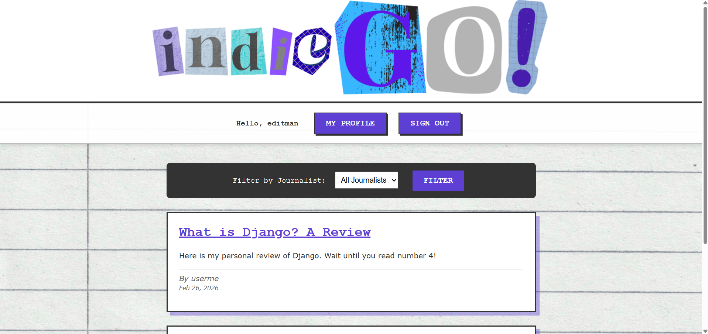
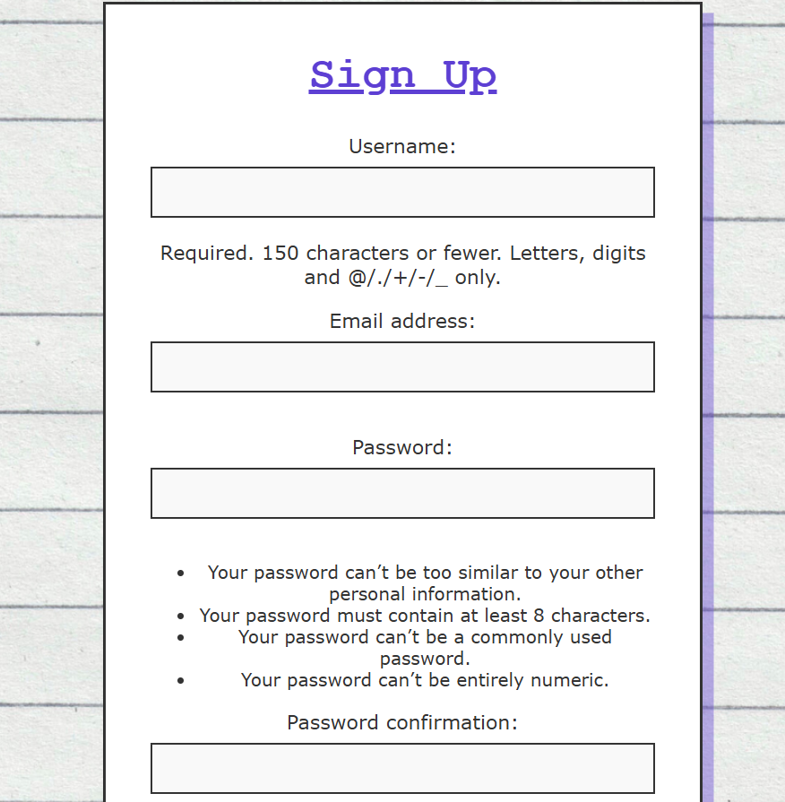
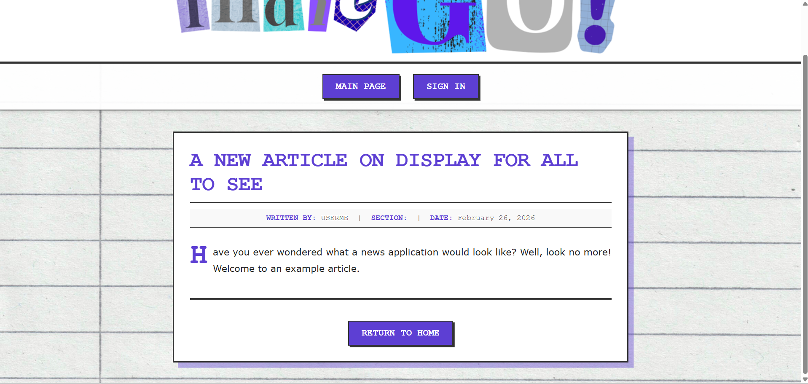

# My Portfolio

A collection of projects showcasing full-stack development skills.

## Projects

### 🗞️ [News App](./news_application)
A full-stack news app built with Django, MySQL, and Docker. Allows the user to register as a journalist, reader, or editor. Journalists can create, edit, and delete articles and newsletters. Editors can edit, approve, or delete articles written by journalists. Once approved, journalist articles appear on the main page and can be subscribed to by readers. If a reader is subscribed to a journalist, they will receive an email when their journalist publishes a newsletter.

#### Instructions

This project is containerized using Docker. You do not need to install Python or MySQL locally to run it.

### 1. Build and Start the App
1. Run this command in the project directory:
```bash
docker compose up --build

2. Create database tables
docker exec -it news-app-container python manage.py migrate

3. Create a superuser (Follow the prompts to set username/password)
docker exec -it news-app-container python manage.py createsuperuser

4. Access the program by opening your browser and navigating to http://localhost:8000

<details>
<summary><strong>📸 Click here to view App Screenshots</strong></summary>
<br>

<br><br>

<br><br>

</details>

### 🧸 [Ecommerce App](./kids_shopping_app)
A full-stack e-commerce app built with Django, MySQL, and Docker. Allows the user to register as a buyer or seller, browse a marketplace and sort by price or seller, leave verified and unverified reviews, and complete checkout with email confirmation.

<details>
<summary><strong>📸 Click here to view App Screenshots</strong></summary>
<br>

</details>

### 📝 [Sticky Notes CRUD App](./sticky_notes)
A sticky notes board showcasing CRUD. Notes can be created, updated, and deleted, and appear on a virtual bulletin board.

### :green_salad: [Restaurant Website](./foodtruck_restaurant_site)
A restaurant website with access to location, menu, about information, and contact details, built using Django.
