# My Portfolio

A collection of projects showcasing full-stack development skills.

## Projects
* [Magic Card Price Tracker](#magic-card-price-tracker)
* [FFTCG API](#fftcg-api)
* [News App](#news-app)
* [Ecommerce App](#ecommerce-app)
* [Card Detection Program](#card-detection-program)
* [Sticky Notes CRUD App](#sticky-notes-crud-app)
* [Game Store Website](#game-store-website)
* [Restaurant Website](#restaurant-website)

### [Magic Card Price Tracker](./mtg_etl)
A streamlit app developed with Python that allows the user to track prices for cards they select. The card data is accessed through Scryfall's API and saved cards are stored in a database. The prices are automatically updated each day at 12 UTC and plotted on a chart. Pricing is shown in USD for both TCGplayer and Cardmarket. The user can sort their saved cards by price, ascending or descending. Searching for a card shows the card image, set, name, and current price. The user may select either foil or non-foil (when available) and can select a time frame for which to track the card, with options including 7 days, 30 days, or indefinitely. Cards can be deleted from the database at any time to remove them from the list. 

 

<strong>📸 Click here to view App Screenshots</strong>

 
<h4>Main Page View</h4>
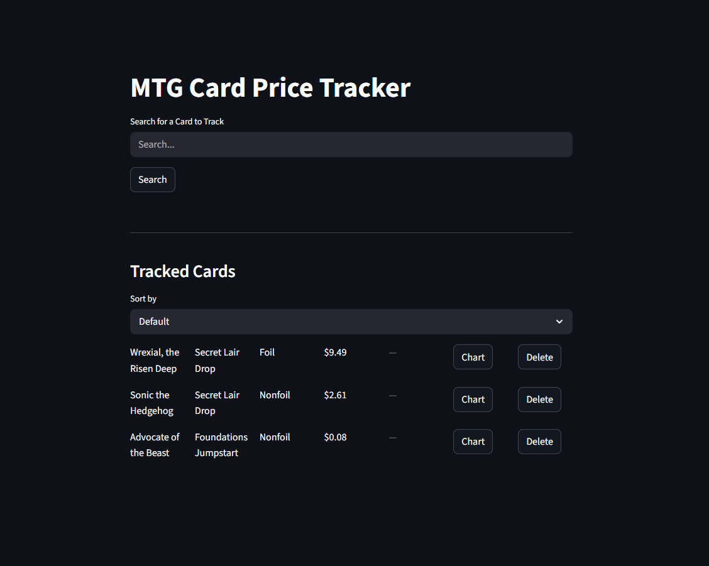
  
<h4>Search View</h4>
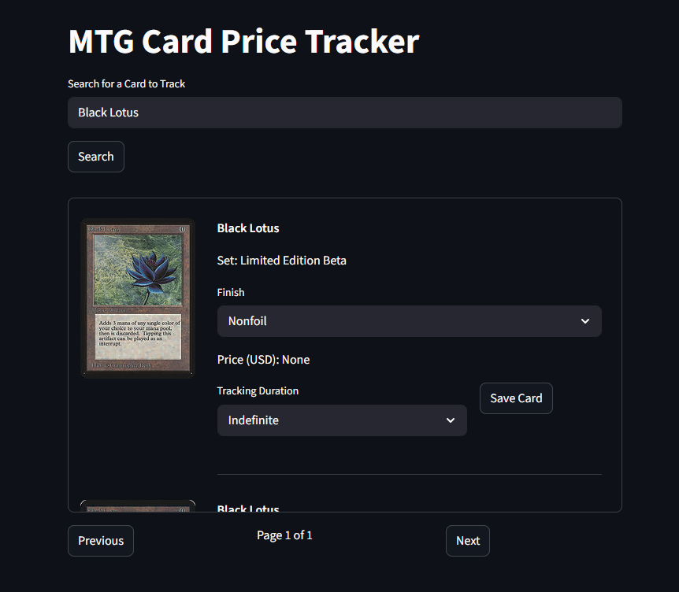
  
<h4>Tracked Cards View</h4>
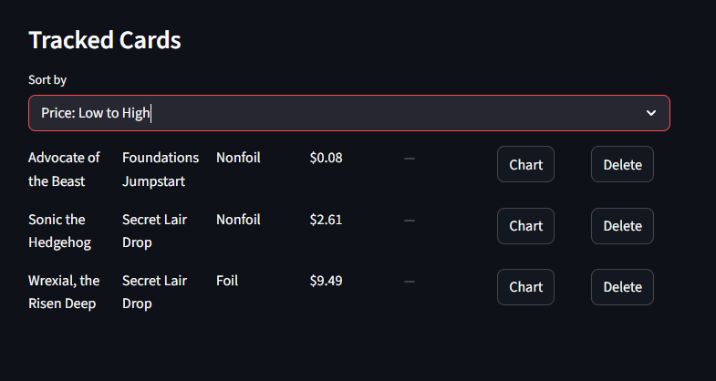
  
<h4>Graph View</h4>
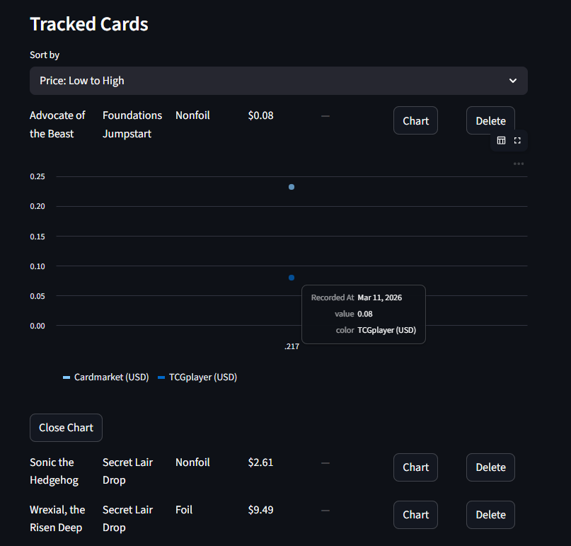

#### Instructions
The app has been published courtesy of Streamlit and Github and is available [here](https://magic-price-track.streamlit.app/).

### [FFtcg API](./mtg_etl)
A RESTful API serving more than 1,800 FFTCG card records using Python and FastAPI. PostgreSQL is implemented for data modeling and queries with Alembic used for database migrations. The project is containerized with Docker and hosted by Railway, available [here](https://fftcg-api-production.up.railway.app/docs#/).

 

<strong>📸 Click here to view App Screenshots</strong>

 
<h4>Main Page View</h4>
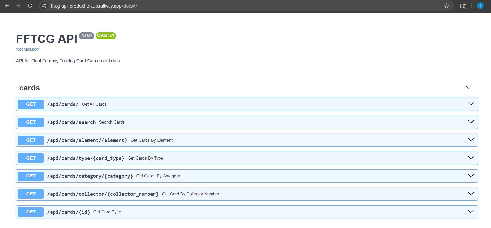
  
<h4>Search View</h4>
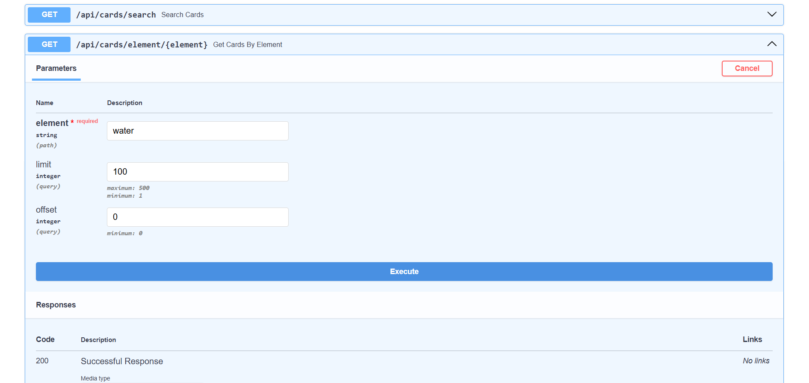
  
<h4>Search Results</h4>

#### Instructions

|Method   |Endpoint   | Description   |
|---|---|---|
|GET   |api/cards   |Get all cards   |
|GET   |api/cards/{id}   |Get card by ID   |
|GET   |api/cards/collector/{number}   |Get cards by collector number   |
|GET|api/cards/search?name={name}|Search cards by name|
|GET|api/cards/element/{element}|Filter by element|
|GET|api/cards/type/{type}|Filter by card type|
|GET|api/cards/category/{category}|Filter by category|

##### Reference
- ID: The card's position within the database (ie: 130)
- Number: The card's collector number, including  (ie: 6-007R, case sensitive)
- Name: The card's name/title (ie: Cornelia)
- Element: The card's element, indicated by crystal color (ie: Water)
- Type: The card's type, listed middle left (ie: Forward)
- Category: The card's category, or the game of origin (ie: VIII)

### [News App](./news_application)
A full-stack news app built with Django, MySQL, and Docker. Allows the user to register as a journalist, reader, or editor. Journalists can create, edit, and delete articles and newsletters. Editors can edit, approve, or delete articles written by journalists. Once approved, journalist articles appear on the main page and can be subscribed to by readers. If a reader is subscribed to a journalist, they will receive an email when their journalist publishes a newsletter.

 

<strong>📸 Click here to view App Screenshots</strong>

 
<h4>Main Page View</h4>
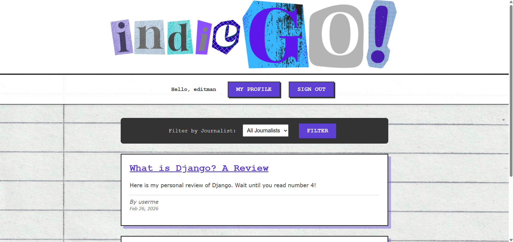
  
<h4>Sign-up Form</h4>
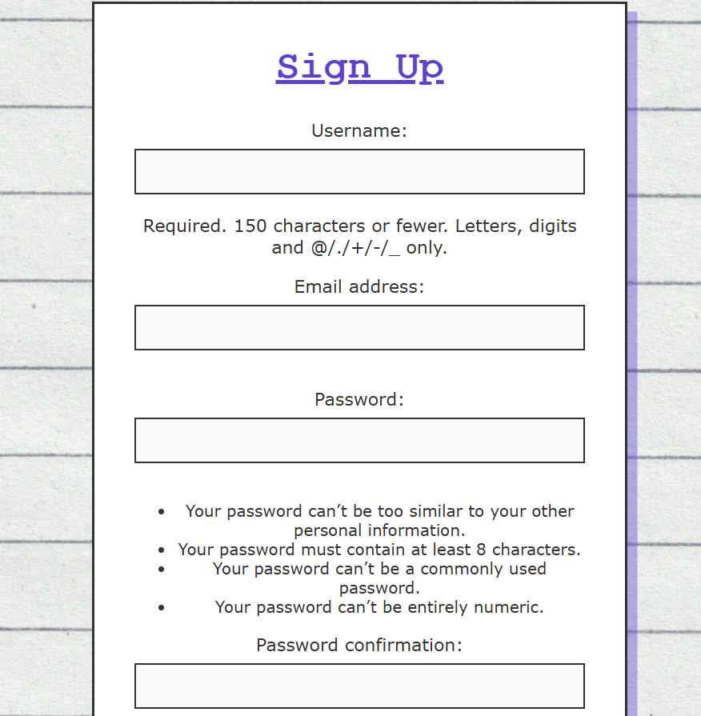
  
<h4>Article Details</h4>
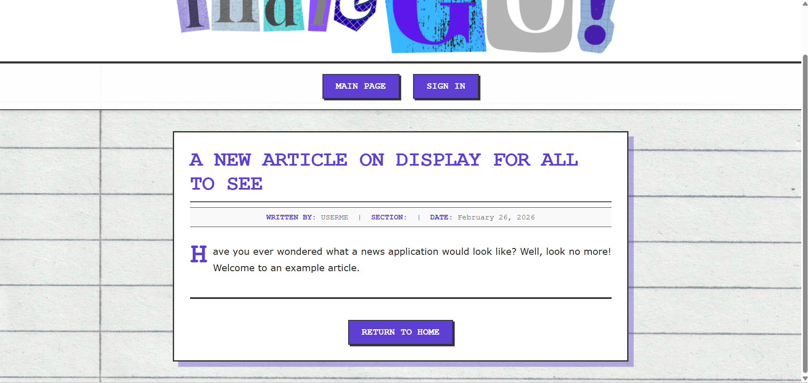

#### Instructions
To view instructions, click [here](./news_application) to see the project specific README file.

### [Ecommerce App](./kids_shopping_app)
A full-stack e-commerce app built with Django, MySQL, and Docker. Allows the user to register as either a buyer or a seller. A buyer may browse the marketplace and sort by price or by seller, add items to a cart and edit or remove them, place an order and receive an email confirmation, and leave reviews. The buyer can leave a verified review if they have purchased the item, or an unverified review if they have not. Sellers have the ability to list items for sale by adding a photo, title, description, price, and available/unavailable status.

 

<strong>📸 Click here to view App Screenshots</strong>

 
<h4>Store View</h4>
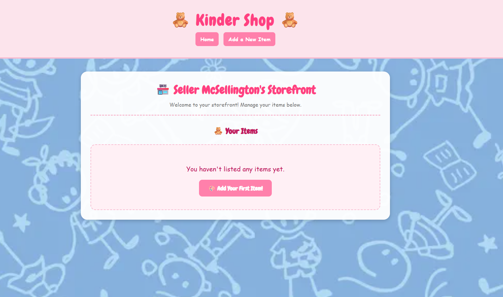
  
<h4>Login Form</h4>
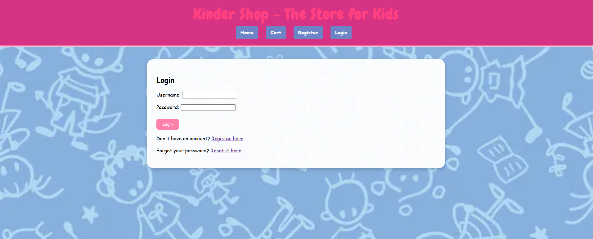
  
<h4>Register Form</h4>
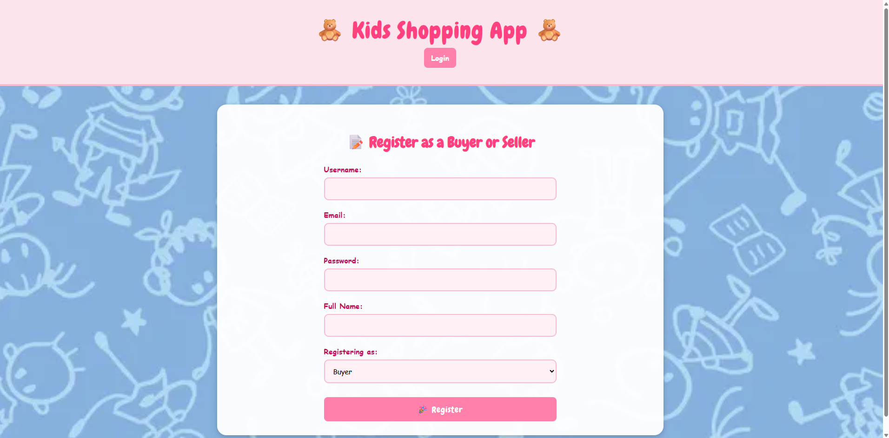
  
<h4>Item Details</h4>
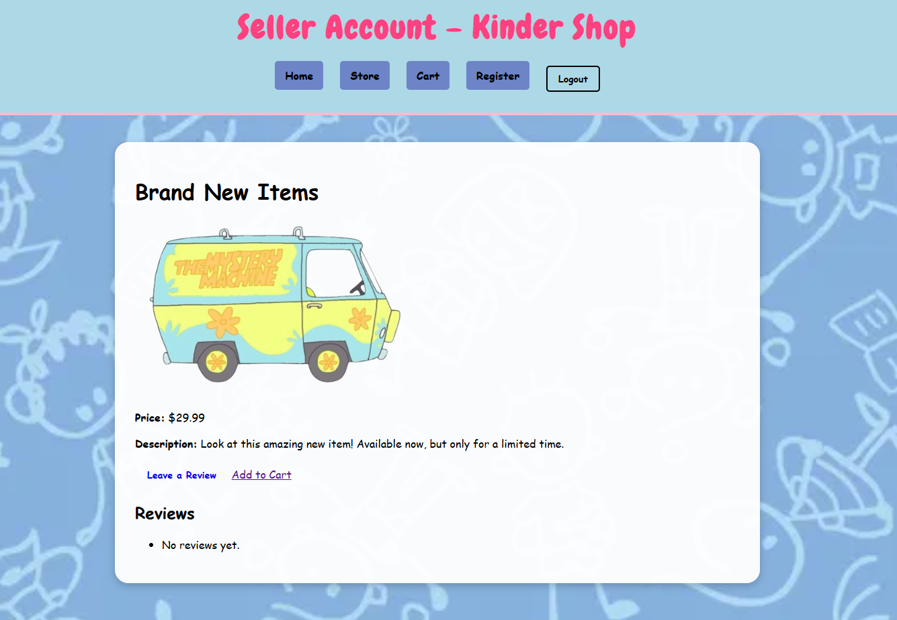

#### Instructions
To view instructions, click [here](./kids_shopping_app) to see the project specific README file.

### [Card Detection Program](./card_detect)
A Python-based vision application that uses OpenCV (cv2) for image processing and Tesseract OCR for text recognition to identify trading cards. The program detects card edges, applies correction, and extracts text from the top and bottom regions to match against an included dictionary of sports keywords such as team names, positions, and card companies.

 

<strong>📸 Click here to view App Screenshots</strong>

 
<h4>Original Card Image</h4>
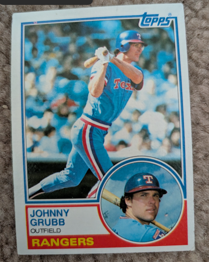
  
<h4>Extracted</h4>

  
<h4>Detection</h4>
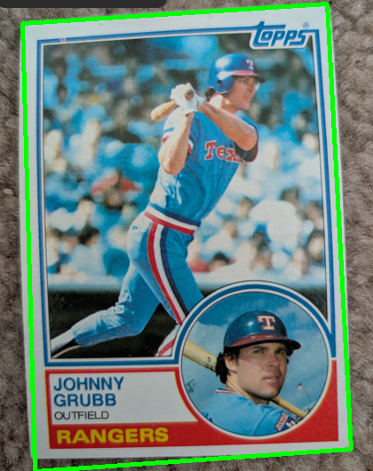
  
<h4>Bottom of the Card</h4>

  
<h4>Bottom Processed</h4>

  
<h4>Top of the Card</h4>

  
<h4>Top Processed</h4>

  
<h4>Edges</h4>
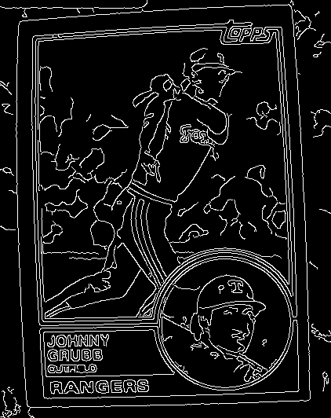
  
<h4>Full Processed Card</h4>
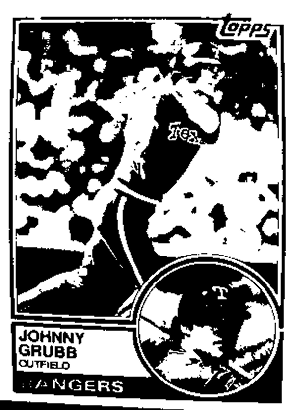
  
<h4>Code Output</h4>
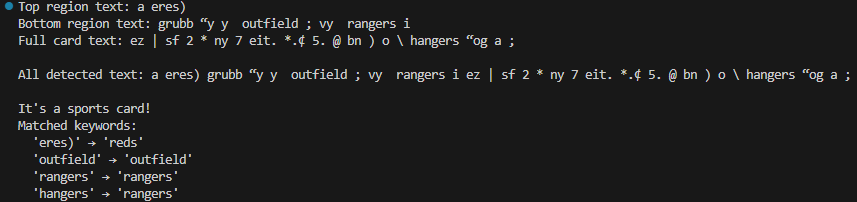
  

#### Instructions
To view instructions, click [here](./card_detect) to see the project specific README file.

### [Sticky Notes CRUD App](./sticky_notes)
A sticky notes board showcasing CRUD. Notes can be created, updated, and deleted, and appear on a virtual bulletin board.

 

<strong>📸 Click here to view App Screenshots</strong>

 
<h4>Main Page View</h4>
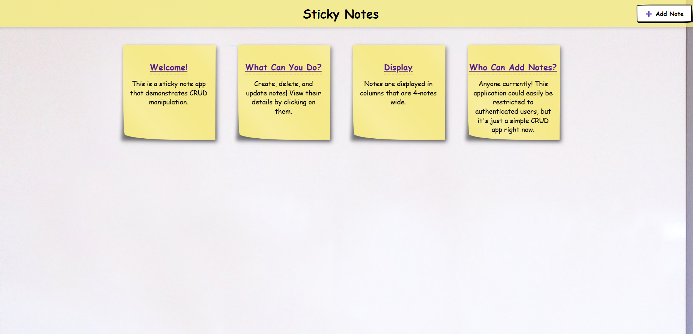
  
<h4>Edit Page</h4>
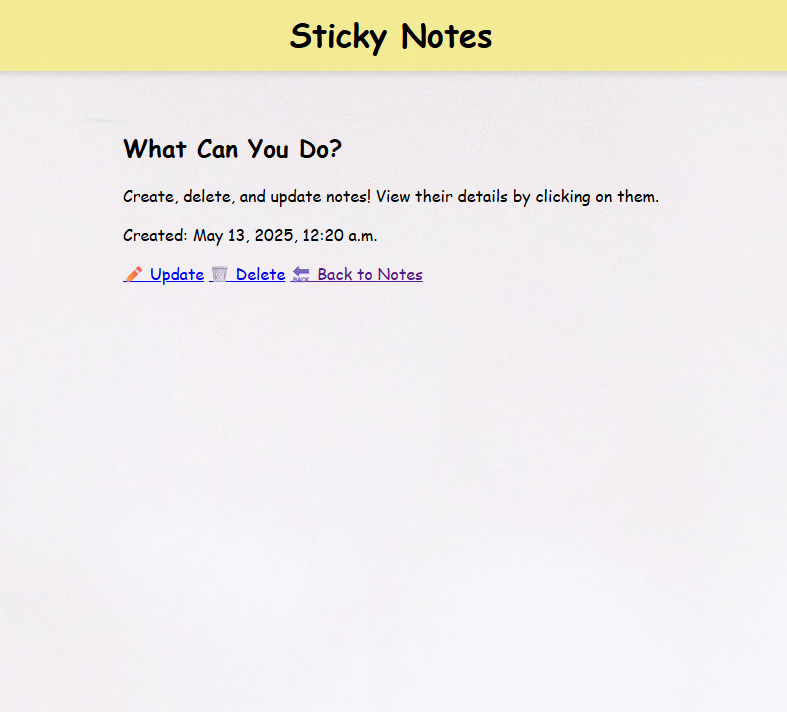

### [Game Store Website](./tcg-trinity)
A full-stack website built using Django with graphics created in Canva. The website displays store details, an embedded Facebook widget, an interactable events calendar, and a contact page.

 

<strong>📸 Click here to view App Screenshots</strong>

 
<h4>Main Page View</h4>
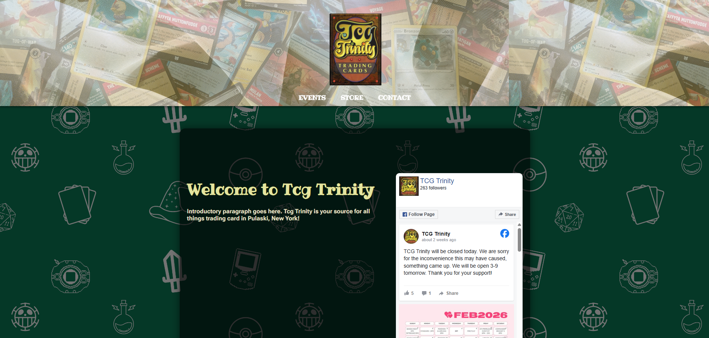
  
<h4>Contact Form</h4>
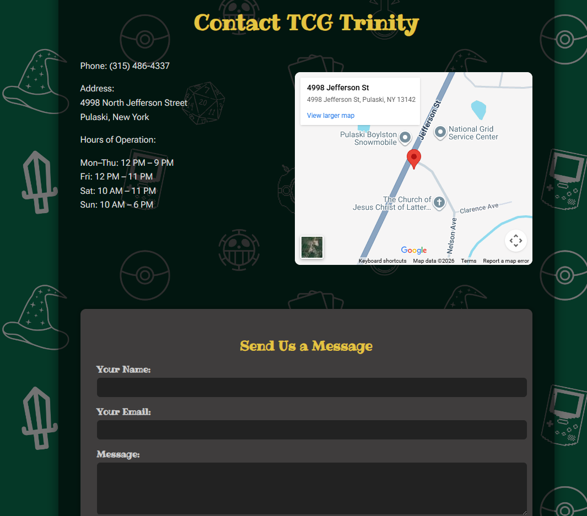
  
<h4>Events Calendar</h4>
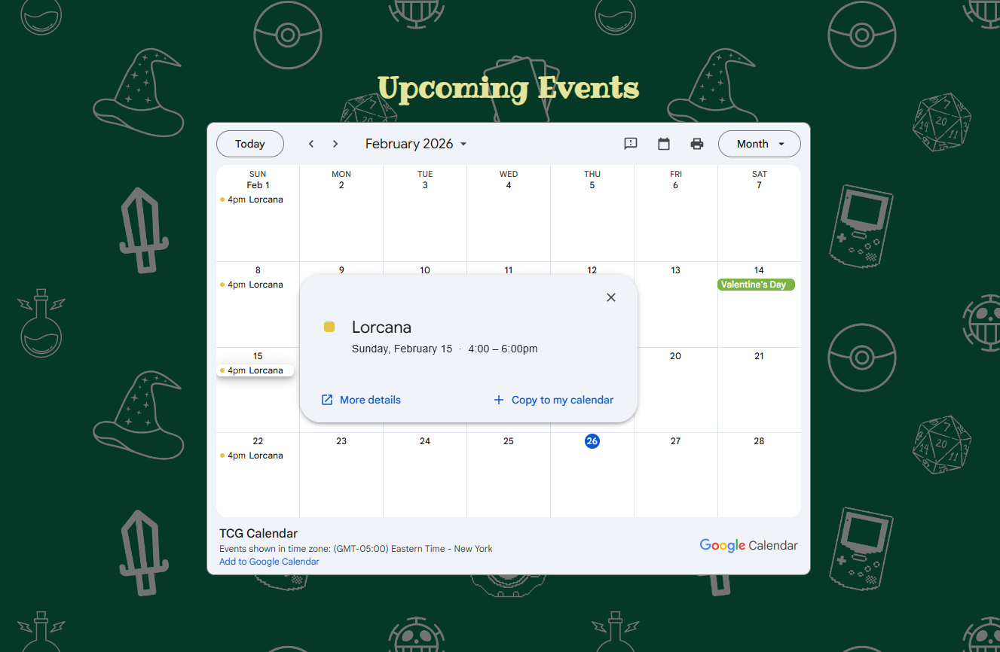
  
<h4>Play Details</h4>
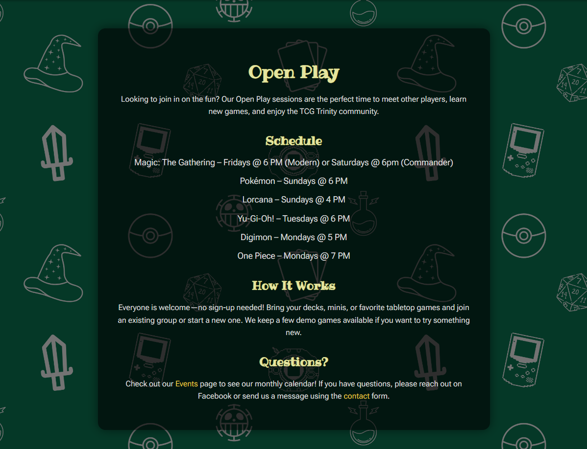

### [Restaurant Website](./foodtruck_restaurant_site)
A restaurant website with access to location, menu, about information, and contact details, built using Django.
